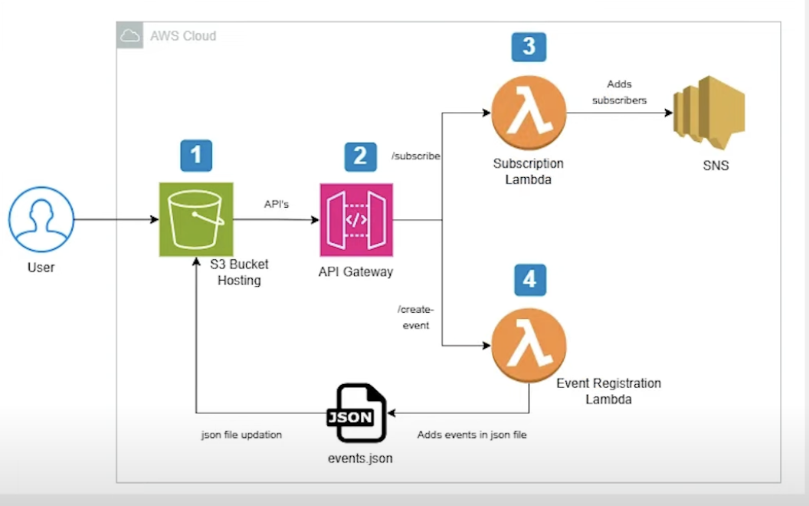

# Event Announcement System with Email Subscriptions

## 🚀 Overview

This project is a serverless web application built on Amazon Web Services (AWS) that allows users to view upcoming events, subscribe to email notifications for new events, and submit new events through a simple web interface. It demonstrates a practical application of serverless architecture, leveraging various AWS services for a scalable, cost-effective, and maintainable solution.

This project was built as a portfolio piece to showcase skills in cloud computing, serverless development, and full-stack application design.

### 🌐 Live Demo

You can check out the **Event Announcement Website** [here](https://event.coffeeincode.click).  
> **Note:** The web page code and design were created by **Gemini**.
 

## ✨ Features

* **View Events:** Users can see a list of upcoming events displayed on the frontend.
* **Email Subscriptions:** Users can subscribe with their email address to receive notifications.
* **New Event Submission:** Users can submit new events (title, date, description) through a form.
* **Automatic Email Notifications:** Subscribers receive an email whenever a new event is created.
* **Dynamic Frontend Updates:** The event list on the frontend updates immediately after a new event is added.
* **Basic Form Validation:** Ensures email format is correct before submission.

## 🏗️ Architecture

The application follows a serverless architecture pattern, minimizing infrastructure management and leveraging managed AWS services.

### Frontend (Static Website)

* **Technologies:** HTML, CSS, JavaScript
* **Data Source:** Event data is fetched from an `events.json` file.
* **Hosting:** Hosted as a static website on **Amazon S3**, providing a publicly accessible URL.

### Backend (Serverless)

* **Amazon API Gateway:**
    * Provides RESTful API endpoints (`/subscribe` and `/create-event`) that act as the entry point for frontend requests.
    * Manages request routing, authorization (if implemented), and CORS.
* **AWS Lambda:**
    * **Subscription Lambda (`subscribeEmailFunction`):**
        * Triggered by a POST request to `/subscribe`.
        * Accepts an email address from the frontend.
        * Subscribes the email address to an Amazon SNS topic.
    * **Event Registration Lambda (`createEventFunction`):**
        * Triggered by a POST request to `/create-event`.
        * Receives new event data (title, date, description).
        * Appends the new event to the `events.json` file stored in the S3 bucket.
        * Publishes a notification message to the SNS topic, triggering email delivery to all confirmed subscribers.
* **Amazon SNS (Simple Notification Service):**
    * Manages a topic (`EventNotificationsTopic`) for email subscriptions.
    * Handles email delivery to all subscribers when a new message (event notification) is published to the topic.
    * Manages the subscription confirmation process (users must confirm their email address).
* **Amazon S3 (Backend Storage):**
    * Stores the `events.json` file, which acts as a simple database for events. The Event Registration Lambda reads from and writes to this file.
* **AWS IAM (Identity and Access Management):**
    * Provides fine-grained access control through IAM roles and policies.
    * Ensures Lambda functions have only the necessary permissions (least privilege) to interact with S3 (read/write `events.json`) and SNS (publish messages, subscribe users).

## ⚙️ How It Works

1.  **User Visits Website:** The user accesses the static website hosted on Amazon S3 via its public URL. The `script.js` file fetches and displays existing events from `events.json`.
2.  **Subscribing to Events:**
    * The user enters their email into the subscription form and clicks "Subscribe."
    * The frontend JavaScript sends a POST request to the `/subscribe` endpoint on API Gateway.
    * API Gateway triggers the `subscribeEmailFunction` Lambda.
    * The Lambda function receives the email and uses the AWS SDK to subscribe the email address to the `EventNotificationsTopic` in SNS.
    * SNS sends a confirmation email to the user. The user must click the link in the email to confirm their subscription.
3.  **Creating a New Event:**
    * The user fills out the "Submit New Event" form (title, date, description) and clicks "Create Event."
    * The frontend JavaScript sends a POST request with the event data to the `/create-event` endpoint on API Gateway.
    * API Gateway triggers the `createEventFunction` Lambda.
    * The Lambda function:
        1.  Retrieves the current `events.json` from the S3 bucket.
        2.  Adds the new event details (including a unique ID and timestamp) to the JSON data.
        3.  Uploads the updated `events.json` back to the S3 bucket.
        4.  Publishes a message (containing the new event details) to the `EventNotificationsTopic` in SNS.
    * SNS then automatically sends an email notification containing the new event details to all confirmed subscribers.
4.  **Viewing New Events:**
    * After a new event is successfully created, the frontend JavaScript re-fetches the `events.json` file from S3 (which now includes the new event) and dynamically updates the event list on the page.

## 🛠️ AWS Services Used

* **Amazon S3 (Simple Storage Service):**
    * Hosts the static frontend website (HTML, CSS, JS).
    * Stores the `events.json` data file.
* **AWS Lambda:**
    * Provides serverless compute for backend logic (handling subscriptions and event creation).
* **Amazon API Gateway:**
    * Creates and manages the REST API endpoints for the Lambda functions.
* **Amazon SNS (Simple Notification Service):**
    * Manages email subscriptions and sends out event notification emails.
* **AWS IAM (Identity and Access Management):**
    * Secures access to AWS resources with roles and policies.
* **Amazon CloudWatch:**
    * Collects logs and metrics from Lambda functions and API Gateway for monitoring and troubleshooting (implicitly used).

## 🚀 Setup & Deployment

* **Frontend:** The static website files (`index.html`, `style.css`, `script.js`, `events.json`) are deployed to an S3 bucket configured for static website hosting.
* **Backend:**
    * Lambda functions are created with Python runtimes.
    * API Gateway endpoints are configured to trigger these Lambda functions using Lambda Proxy integration.
    * IAM roles and policies are attached to Lambda functions to grant necessary permissions.
    * Environment variables are used in Lambda functions to store resource identifiers like S3 bucket names and SNS topic ARNs.

*(You can add a section here if you implement the CI/CD pipeline, detailing how to set it up or how it works.)*

## 🔮 Future Enhancements (Planned/Possible)

* **CI/CD Pipeline:** Implement a CI/CD pipeline (e.g., using GitHub Actions) to automate the deployment of frontend and backend changes.
* **Database Integration:** Replace `events.json` with a more robust database solution like Amazon DynamoDB for better scalability and querying.
* **Event Editing/Deletion:** Add functionality for users to edit or delete existing events.
* **User Authentication:** Implement user accounts (e.g., with Amazon Cognito) to restrict event creation or manage user-specific subscriptions.
* **Advanced Email Formatting:** Use HTML templates for richer email notifications.
* **Custom Domain:** Configure a custom domain name for the application.

---

This project demonstrates a foundational serverless application. Feel free to explore the code and suggest improvements!
